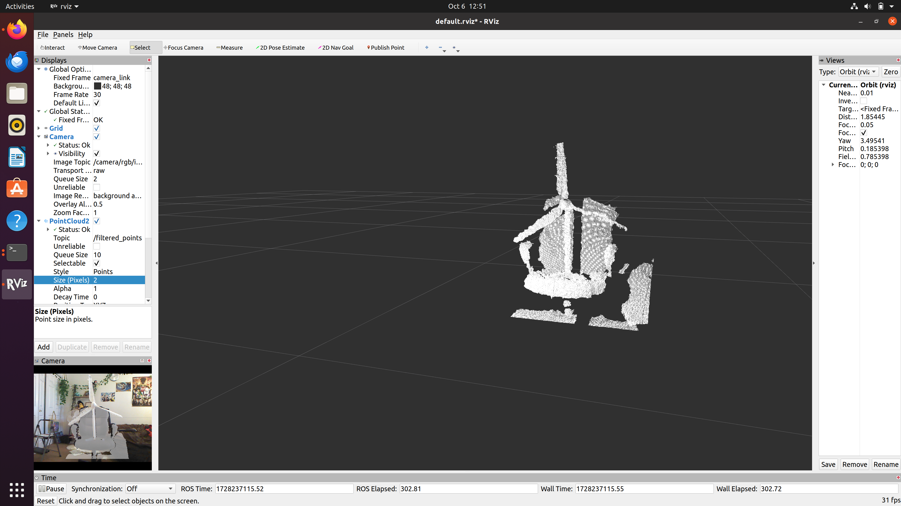

# Wind Turbine Digital Twins

- Dashboard to monitor a wind turbine
- Model for Predictions
- How to use multiple sensors

## Table of Contents
- [Introduction](#introduction)
- [Installation](#installation)
- [Usage](#usage)
- [Raspberry Pi Setup](#RaspberryPi)
- [Dashboard Setup](#Dashboard)
- [ROS/RViz Setup](#RViz)
- [Contributing](#contributing)
- [License](#license)

## Introduction
Some introductory text here.

# RaspberryPi

## Raspberry Libraries Required

To set up the necessary libraries and configurations for this project on a Raspberry Pi, follow these steps:

### Install Required Python Libraries

Run the following commands to install the required Python libraries:

- `pip install python3-rpi.gpio`
- `pip install Adafruit-GPIO`
- `pip3 install influxdb-client`
- `pip3 install adafruit-circuitpython-ina260`
- `pip3 install gpiozero`

### Enable I2C Connection

Run the Raspberry Pi configuration tool to enable I2C:

- Use the command `sudo raspi-config`.
- Navigate to **"Interfacing Options"** and enable **I2C**.

### Enable Serial Connection

Using the same Raspberry Pi configuration tool (`raspi-config`):

- Navigate to **"Interfacing Options"**.
- Enable **Serial**.

---

## Using the Raspberry Pi Folder

1. Copy or extract the **Raspberry Pi Folder** onto your Raspberry Pi OS.
2. Inside the folder, you'll find a `Makefile` that can run all your sensor programs.
**{Warning}** Before you start programs, make sure to check all the [Sensors Setup](#Sensors) guidelines to set up your sensors correctly!

### Commands for Running Programs

- To run all programs:
  - `make run_all`
- To stop all programs gracefully:
  - `make stop_all`

   

## Setting up the MQTT Broker

Install pip3 install paho-mqtt
sudo apt install mosquitto mosquitto-clients

2. Configure Mosquitto for External Access

To allow other computers on your network to connect to the broker, open the Mosquitto configuration file:

sudo nano /etc/mosquitto/mosquitto.conf

Add the following lines to the file to enable anonymous access (only do this if your network is secure) or set up user authentication if needed:

allow_anonymous true
listener 1883

sudo systemctl restart mosquitto to reboot the Mosquitto

## Dashboard 

My partner and I used visual code for navigating and running our flask application for our dashboard.
Before navigating for cd /docker inside of WindTurbine
You will need to download Docker and turn on docker. 

If your docker is on, you can do docker-compose up -d --build or docker-compose down to stop all containers.

Once all containers are activated, you will go to localhost:5000 which will take you to the page localhost:5000/socket if your MQTT Broker IP is correct if Raspberry Pi is running all the programs in the [Raspberry Pi Setup](#RaspberryPi). 

## RViz

## ROS/RViz Dependencies

To use this project, you must install the following dependencies:

- **ROS Noetic**: The ROS distribution used for managing the various packages and nodes required for the digital twin.
- **freenect_stack**: This library enables the Xbox Kinect 360 camera to function with ROS, providing the necessary data to generate a 3D point cloud of the wind turbine.

## Build Instructions

Extract the digital_ws zip 

You are going need to erase previous and do catkin_make

The pathing might be wrong which need to be fixed. 

Make sure to do ~/path/digital_ws/devel/setup.bash

Once you have done all this, you should be able to do

roslaunch freenect_launch freenect.launch 

The command `roslaunch pointcloud_filter filter_kinect.launch` is used to test the program by launching the point cloud filtering process. (This is my code filter)

The program should already open RVIZ for you!

If you want to add a camera, set your topic to /camera/rgb/image_color for color image

Now add PointCloud2 for the Lidar scanner, using `/filtered_points`

## Sensors 
## BMEO055
documention for BMEO055
https://cdn-learn.adafruit.com/downloads/pdf/bno055-absolute-orientation-sensor-with-raspberry-pi-and-beaglebone-black.pdf
Note I did have to changed Adafruit.GPIO to using the RPIO library.

## INA260 
https://www.youtube.com/watch?v=ym5ioJFsh4M
Make sure to install the adafruit ina260 library 
Wires are the same with Raspberry Pi 5

## HallEffect
https://circuitdigest.com/microcontroller-projects/interfacing-hall-sensor-with-raspberry-pi

## AngularServo
https://www.youtube.com/watch?v=40tZQPd3z8g&t=351s

## MQTT

http://www.steves-internet-guide.com/mqtt/
`mosquitto_sub -h 192.168.1.205 -t wind_turbine/hall_effect`

